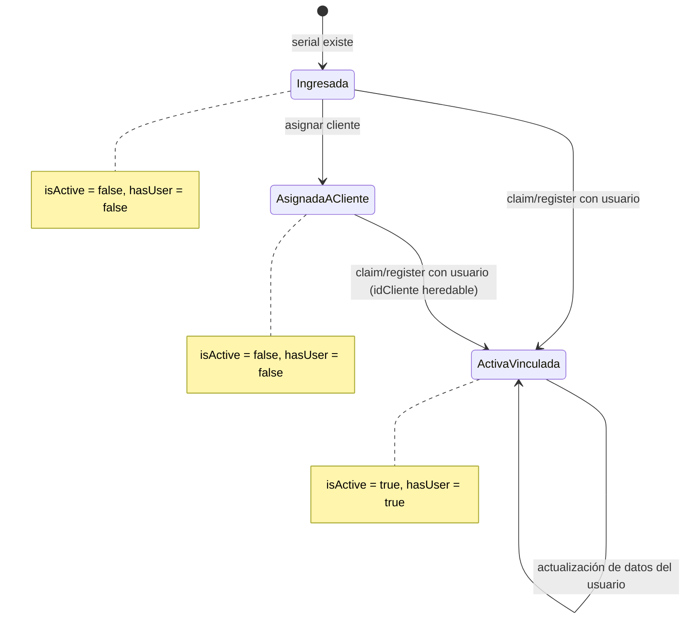
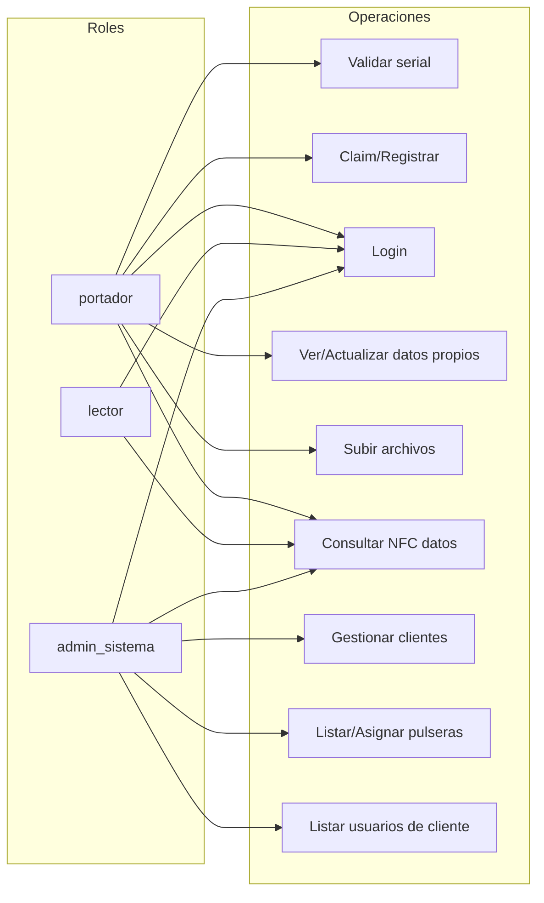

## Comportamiento Funcional del Sistema TGH

### Propósito y alcance
- Este documento describe, para los dueños del producto, qué hace la aplicación y cómo lo hace desde la perspectiva de operaciones de usuario.
- Cobertura: operaciones por rol, flujos clave y reglas de negocio críticas. No incluye detalles técnicos profundos ni contratos de API por campo.

### Audiencia
- Propietarios del producto y responsables de decisión funcional.


## Roles y objetivos

- **admin_sistema (Administrador del sistema)**
  - Objetivo: administrar clientes, pulseras y usuarios del ecosistema.
  - Alcance: operaciones de backoffice (asignaciones, listados, altas básicas).

- **portador (Usuario portador de pulsera)**
  - Objetivo: activar/vincular su pulsera, administrar sus datos personales, vitales y contactos de emergencia, y subir archivos asociados.
  - Alcance: gestión propia y acceso a su información.

- **lector (Usuario lector)**
  - Objetivo: autenticarse para operar la app con permisos de lectura limitada y consultar información pública NFC cuando corresponda.
  - Alcance: no modifica datos; acceso a perfiles NFC sujeto a visibilidad definida por el cliente.


## Módulos y operaciones por rol

### 1) Autenticación y registro
- **Login**: `POST /api/login`
  - Permite autenticarse a cualquier rol activo (admin_sistema, portador, lector).
  - Regla crítica: usuario inactivo no puede iniciar sesión.
- **Registro de portador con serial**: `POST /api/register`
  - Crea usuario (rol `portador`) vinculado a una pulsera existente, no activada y disponible.
- **Registro de lector (sin serial)**: `POST /api/register-lector`
  - Crea usuario con rol `lector` para usos operativos sin vínculo a pulsera.
- **Validación de serial**: `POST /api/validate-serial`
  - Verifica existencia y disponibilidad del serial previo a registro o claim.
- **Claim/Activación guiada (página pública)**: `/nfc/[serial]`
  - Si la pulsera no está vinculada, muestra formulario de claim.
  - Acción de claim: `POST /api/claim-pulsera` (rol por defecto: `portador`).

### 2) Perfil del portador y datos
- **Consultar datos del usuario**: `GET /api/user-data`
  - Devuelve datos personales, vitales, contactos y resumen de la pulsera vinculada.
- **Actualizar datos del usuario**: `PUT /api/user-data` o `PUT /api/update-user-data`
  - Tipo `personales`: nombre, apellido, fecha de nacimiento, teléfono, email.
  - Tipo `vitales`: grupo sanguíneo, alergias, medicación, enfermedades crónicas, peso, altura, observaciones.
  - Tipo `contactos`: reemplazo/gestión de contactos de emergencia (ordenados).
- **Subida de archivos**: `POST /api/upload-file`
  - Tipo `foto`: imagen de perfil del portador.
  - Tipo `certificado_grupo_sanguineo`: imagen o PDF.

### 3) NFC y visibilidad de perfiles
- **Página pública de emergencia**: `/nfc/[serial]`
  - Muestra datos públicos si la pulsera está activa y vinculada; si no, ofrece claim.
- **Datos públicos para NFC (API)**: `GET /api/nfc-data/[serial]`
  - Control de visibilidad por cliente (público/privado). Si privado, solo solicitantes pertenecientes a ese cliente obtienen datos.

### 4) Administración (admin_sistema)
- **Clientes**
  - Alta de cliente: `POST /api/clientes` (o `POST /api/admin/clientes` con `x-admin-key`).
  - Listar usuarios de cliente: `GET /api/clientes/[id]/usuarios`.
  - Listar pulseras de cliente: `GET /api/clientes/[id]/pulseras`.
- **Pulseras**
  - Listar todas: `GET /api/pulseras`.
  - Listar disponibles (sin cliente): `GET /api/pulseras/disponibles`.
  - Asignar pulsera a cliente: `POST /api/clientes/[id]/pulseras`.
  - Asignar cliente a pulsera por id (estricto): `PATCH /api/admin/pulseras/[id]` (con `x-admin-key`).


## Reglas de negocio críticas

### Identidad y seguridad
- **Usuarios**
  - Username único. Contraseña con políticas: mínimo 8 caracteres, al menos 1 mayúscula, 1 minúscula, 1 número y 1 símbolo.
  - Usuario inactivo no puede autenticarse.
  - JWT incluye `rol` y `idCliente` (según corresponda).
- **Acceso por rol (middleware)**
  - Rutas públicas: landing, activación, registro, login, NFC y validación de serial.
  - Rutas protegidas: requieren token válido.
  - Rutas admin: además requieren `rol = admin_sistema`.

### Pulseras
- **Serial**
  - Debe existir para registrar o reclamar. Si no existe: error (404/400 según flujo).
  - Si ya está activado o vinculado a usuario: no se puede re-vincular (409).
- **Estados operativos (derivados)**
  - `exists` (existe el serial)
  - `isActive` (pulsera activada)
  - `hasUser` (hay usuario vinculado)
- **Activación (claim)**
  - Crea usuario `portador`, vincula pulsera, activa `is_active = TRUE` y genera `public_url` (`/nfc/[serial]`).
- **Asignación a cliente**
  - Una pulsera sin cliente puede asignarse a un cliente.
  - Si ya está asignada a un cliente distinto: no transferible (409).
  - Si ya está asignada al mismo cliente: operación idempotente (éxito con mensaje).

### NFC y visibilidad
- **Visibilidad a nivel cliente**: `publico` o `privado`.
  - Si `privado`, solo solicitantes autenticados cuyo `idCliente` coincida con el del perfil pueden acceder a los datos públicos NFC.
  - Si `publico`, la información pública NFC se expone a cualquier solicitante.

### Datos del portador
- **Actualización de datos**
  - Solo el propio usuario puede leer/actualizar sus datos.
  - Campos permitidos y validaciones de formato (fechas, teléfonos y emails válidos).
  - Contactos de emergencia se reescriben en orden; eliminación por `id` valida pertenencia.
- **Subida de archivos**
  - Tamaño máximo: 5MB.
  - Tipos permitidos: 
    - `foto`: `image/jpeg`, `image/png`, `image/webp`.
    - `certificado_grupo_sanguineo`: `image/jpeg`, `image/png`, `application/pdf`.
  - Los archivos se suben a Storage (público) y se actualiza la referencia en la BD.


## Casos de uso y endpoints (sin contratos detallados)

### Portador
- Validar serial antes de registrar/claim: `POST /api/validate-serial`.
- Registrar usuario con serial (si elegible): `POST /api/register`.
- Reclamar pulsera desde página pública: `POST /api/claim-pulsera` (+ `/nfc/[serial]` como UI).
- Iniciar sesión: `POST /api/login`.
- Ver sus datos: `GET /api/user-data`.
- Actualizar sus datos: `PUT /api/user-data` o `PUT /api/update-user-data`.
- Subir archivos: `POST /api/upload-file` (foto, certificado).
- Ver página pública de emergencia: `GET /nfc/[serial]`.

### Lector
- Registrarse (sin serial): `POST /api/register-lector`.
- Iniciar sesión: `POST /api/login`.
- Consultar datos NFC respetando visibilidad: `GET /api/nfc-data/[serial]`.

### Administrador del sistema
- Clientes:
  - Crear: `POST /api/clientes` (o `POST /api/admin/clientes` con `x-admin-key`).
  - Listar usuarios de cliente: `GET /api/clientes/[id]/usuarios`.
  - Listar pulseras de cliente: `GET /api/clientes/[id]/pulseras`.
- Pulseras:
  - Listar todas: `GET /api/pulseras`.
  - Listar disponibles: `GET /api/pulseras/disponibles`.
  - Asignar a cliente: `POST /api/clientes/[id]/pulseras`.
  - Asignar cliente por id (estricto): `PATCH /api/admin/pulseras/[id]` (con `x-admin-key`). 


## Diagramas (Mermaid)

### Flujo de validación y claim de pulsera
```mermaid
flowchart TD
  A[Usuario ingresa serial] --> B{POST /api/validate-serial}
  B -->|404| E[Serial no encontrado]
  B -->|409| F[Pulsera ya activada]
  B -->|200| C[Serial válido y disponible]
  C --> D[/nfc/[serial] muestra ClaimForm]
  D --> G{POST /api/claim-pulsera}
  G -->|409| H[Pulsera ya vinculada]
  G -->|404| E
  G -->|200| I[Crear usuario portador + activar pulsera + JWT]
  I --> J[Redirigir a dashboard del portador]
```

### Estados de pulsera (derivados)


### Acceso NFC según visibilidad
```mermaid
flowchart LR
  A[Solicitud GET /api/nfc-data/[serial]] --> B{Pulsera activa y vinculada?}
  B -- No --> X[403 Acceso no disponible]
  B -- Sí --> C{Cliente visibilidad}
  C -- publico --> D[Devolver datos públicos]
  C -- privado --> E{Solicitante pertenece al cliente?}
  E -- No --> X
  E -- Sí --> D
```

### Mapa de roles a operaciones



## Notas de UI (alto nivel)
- `/nfc/[serial]` muestra:
  - Si no hay usuario vinculado: bloque de “Activa tu cuenta” con `ClaimForm`.
  - Si hay datos públicos: información personal, vital y contactos principales.
- En dashboard del portador: edición de datos personales y vitales, y gestión de contactos y archivos.
- Zonas administrativas (admin): listados y asignación de pulseras por cliente.


## Glosario breve
- **Claim**: proceso por el cual el portador crea su usuario y vincula la pulsera, activándola.
- **Visibilidad de cliente**: determina si los datos NFC del portador son accesibles públicamente (`publico`) o solo para miembros del mismo cliente (`privado`).
- **Pulsera disponible**: pulsera sin cliente asignado.


## Anexos
- Diagrama ER resumido: ver `Database/DER.txt` y scripts SQL en `Database/`.


